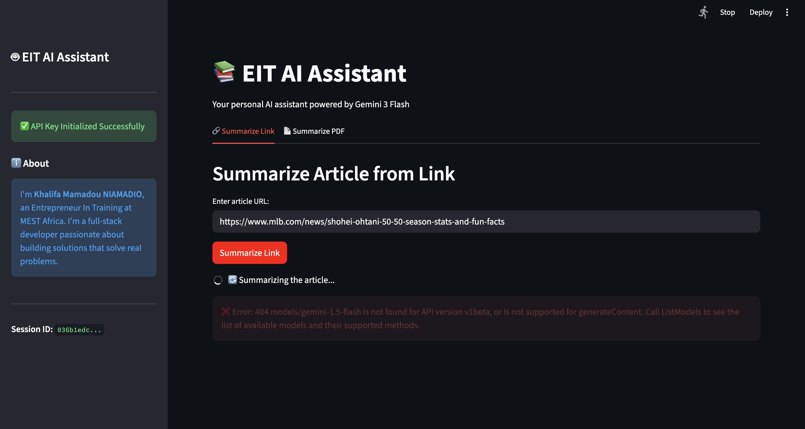
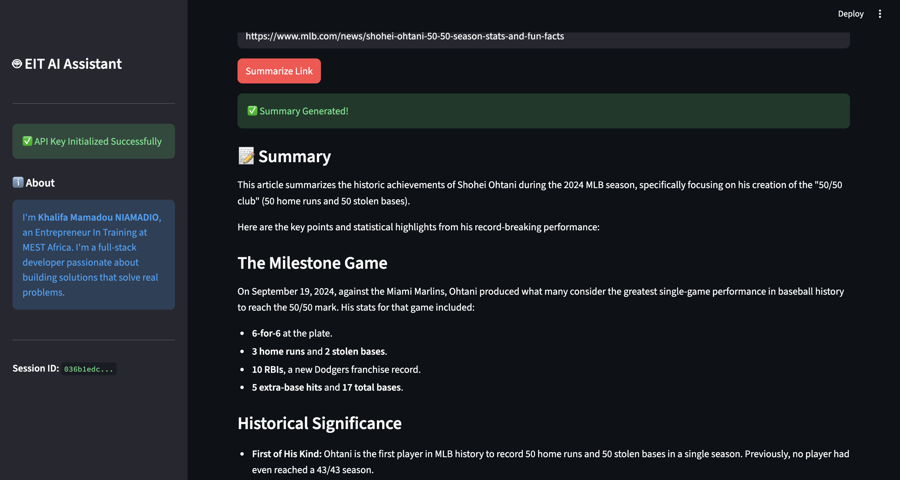
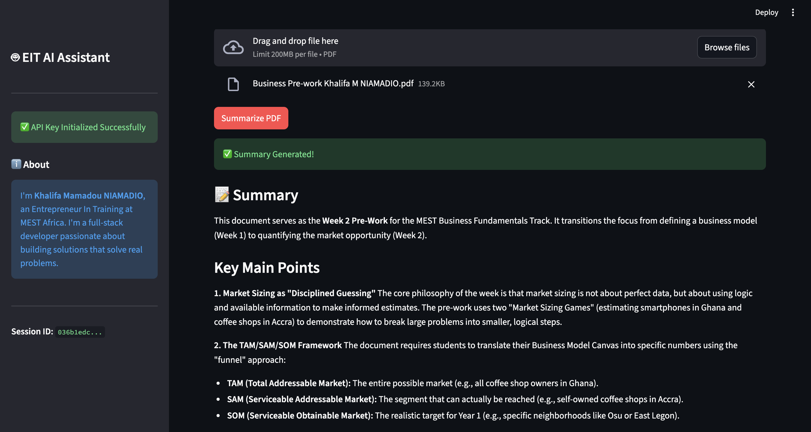

# EIT AI Assistant 🤖

An AI-powered article summarization assistant built with Streamlit and Google Gemini. The assistant embodies the personality of Khalifa Mamadou NIAMADIO — an Entrepreneur In Training at MEST Africa.

## Features

- **🔗 Link Summarization**: Paste any article URL and get an instant summary
- **📄 PDF Summarization**: Upload PDF documents for quick summarization
- **👤 EIT Personality**: Powered by the persona of Khalifa Mamadou NIAMADIO
- **📊 Logging**: Comprehensive JSON-based event logging

## Prerequisites

- Python 3.8+
- Google Gemini API Key

## Installation

### 1. Clone the Repository

```bash
git clone <repository-url>
cd <repository-name>
```

### 2. Create Virtual Environment (Recommended)

```bash
python -m venv venv
source venv/bin/activate  # On Windows: venv\Scripts\activate
```

### 3. Install Dependencies

```bash
pip install -r requirements.txt
```

### 4. Configure API Key

1. Copy the example environment file:

```bash
cp .env.example .env
```

2. Get your Google Gemini API key:
   - Visit [Google AI Studio](https://aistudio.google.com/app/apikey)
   - Create a new API key
   - Copy it to your `.env` file:

```
GOOGLE_API_KEY=your_actual_api_key_here
```

## Running the Application

### Start the Streamlit Server

```bash
streamlit run app.py
```

The application will open in your default browser at `http://localhost:8501`.

## Usage

### Method 1: Summarize a Link

1. Open the app in your browser
2. Go to the **"Summarize Link"** tab
3. Paste the article URL
4. Click **"Summarize Link"**
5. Read the AI-generated summary

### Method 2: Summarize a PDF

1. Open the app in your browser
2. Go to the **"Summarize PDF"** tab
3. Upload your PDF file
4. Click **"Summarize PDF"**
5. Read the AI-generated summary

## Demo

### Link Summarization Example
Successfully summarized an MLB article about Shohei Ohtani's 50-50 season:




### PDF Summarization Example
Successfully summarized a PDF document:


## Project Structure

```
.
├── app.py                 # Main Streamlit application
├── requirements.txt       # Python dependencies
├── .env.example          # Environment variables template
├── .env                  # Your API key (not tracked in git)
├── logs/
│   └── app.log.json      # Application logs
├── screenshots/         # Demo screenshots
└── README.md             # This file
```

## Logging

All events are logged to `logs/app.log.json` with the following structure:

```json
{
    "timestamp": "2026-02-09T16:34:01.476592",
    "level": "INFO",
    "type": "user_input",
    "metadata": {
        "user_id": "user_97d5c393",
        "session_id": "97d5c393-d2e1-4d79-bf7a-7cda8fc05912",
        "model": "gemini-3-flash-preview"
    }
}
```

## About EIT Personality

The AI assistant is configured with the personality of **Khalifa Mamadou NIAMADIO**:

- **Role**: Full-stack Developer, Technology Innovator, Entrepreneur
- **Current**: Entrepreneur In Training at MEST Africa
- **Skills**: ReactJS, React Native, Node.js, Spring Boot, Supabase
- **Notable Projects**: ADEC Education

### Personality Traits

- 🌟 Driven and Detail-Oriented
- 🧠 Learner at Heart
- 🤝 Collaborative and Vision-Oriented
- 🔍 Thoughtful Planning
- 🧩 Balance Between Performance and Usability
- 📈 Vision for Continuous Growth

## Troubleshooting

### API Key Issues

If you see an API key error:
1. Verify your `.env` file exists and contains `GOOGLE_API_KEY`
2. Ensure the API key is valid (not expired)
3. Restart the Streamlit server after updating the `.env` file

### PDF Extraction Issues

For PDF files that don't extract properly:
- Ensure the PDF contains selectable text (not scanned images)
- Try with a different PDF format

### Connection Issues

If requests timeout:
- Check your internet connection
- Verify the URL is accessible
- Try again later if Gemini API is experiencing issues

## License

MIT License

## Author

**Khalifa Mamadou NIAMADIO**
- Entrepreneur In Training at MEST Africa
- Full-stack Developer
- Technology Innovator
